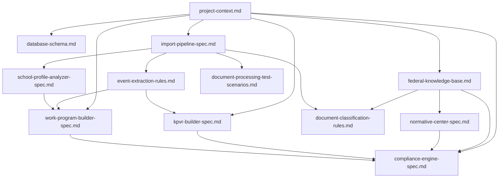

# Architecture Documentation Index

## Назначение

Этот документ является индексом архитектурной документации Воспитание.PRO и результатом аудита созданных спецификаций.

Индекс помогает быстро понять:

- какие документы уже описывают архитектуру продукта;
- как документы связаны между собой;
- какие правила являются общими для всех модулей;
- есть ли противоречия;
- какие документы использовать при дальнейшем проектировании.

Код проекта при создании этого индекса не изменялся.

## Общие архитектурные правила

Все документы должны соответствовать правилам из `AGENTS.md`.

Ключевые правила:

- `SchoolEvent` является источником истины для мероприятий;
- КПВР, планы деятельности, отчеты и рабочая программа используют мероприятия как проекции, а не копии;
- данные из документов не импортируются автоматически;
- все извлеченные записи проходят preview, validation, duplicate detection и user confirmation;
- низкоуверенные записи остаются в preview;
- Demo Mode и Work Mode должны оставаться изолированными;
- внешние AI API не используются без отдельного решения;
- будущие AI-анализаторы должны подключаться через заменяемые контракты;
- федеральные требования имеют приоритет над региональными, муниципальными и локальными документами.

## Список документов

### Общий контекст проекта

- [project-context.md](./project-context.md) — назначение продукта, целевые пользователи, основные сущности, нормативная база, связи между сущностями, текущий MVP и долгосрочное видение.
- [database-schema.md](./database-schema.md) — предполагаемая структура таблиц Supabase и основные решения по хранению данных.
- [acceptance-test-report.md](./acceptance-test-report.md) — приемочный отчет по пользовательским сценариям.

### Федеральная и нормативная база

- [federal-knowledge-base.md](./federal-knowledge-base.md) — база знаний по ФГОС, ФОП, федеральной рабочей программе воспитания, федеральному календарному плану, стратегии, Движению Первых и Орлятам России.
- [document-classification-rules.md](./document-classification-rules.md) — правила классификации документов по уровню, типу, признакам, ключевым словам и возможным извлекаемым данным.
- [normative-center-spec.md](./normative-center-spec.md) — работа Нормативного центра: хранение документов, категории, актуальность, версии, связи с рабочей программой, КПВР, мероприятиями и проверкой соответствия.
- [compliance-engine-spec.md](./compliance-engine-spec.md) — механизм проверки соответствия рабочей программы, КПВР, планов деятельности, воспитательной системы и нормативной базы.

### Документный контур и импорт

- [import-pipeline-spec.md](./import-pipeline-spec.md) — полный конвейер обработки документов: загрузка, тип файла, OCR, извлечение текста, классификация, извлечение сущностей, качество, preview, дубли, подтверждение и импорт.
- [event-extraction-rules.md](./event-extraction-rules.md) — правила извлечения мероприятий из КПВР, планов деятельности, рабочих программ, отчетов, приказов и федерального календарного плана.
- [document-processing-test-scenarios.md](./document-processing-test-scenarios.md) — тестовые сценарии для DOCX, PDF, XLSX, пустых, поврежденных, больших и сканированных файлов.
- [school-profile-analyzer-spec.md](./school-profile-analyzer-spec.md) — анализ школы на основе документов: традиции, объединения, партнеры, инфраструктура, направления деятельности, ключевые мероприятия и ответственные.

### Генерация документов школы

- [work-program-builder-spec.md](./work-program-builder-spec.md) — механизм автоматической сборки рабочей программы воспитания школы.
- [kpvr-builder-spec.md](./kpvr-builder-spec.md) — механизм автоматической сборки КПВР по НОО, ООО и СОО из `SchoolEvent`, направлений, федерального календаря и воспитательной системы.

## Карта связей между документами

## Проверка ссылок

В документах почти нет явных Markdown-ссылок между файлами. Поэтому для индекса добавлены относительные ссылки на все ключевые спецификации.

Проверка:

- все перечисленные файлы существуют в `docs`;
- ссылки в этом индексе используют относительный формат `./file.md`;
- битых Markdown-ссылок в созданных спецификациях не обнаружено;
- явная навигация между документами ранее отсутствовала и теперь обеспечена через `architecture-index.md`.

## Проверка отсутствия противоречий

### Согласованные правила

Документы согласованы по ключевым принципам:

- мероприятия не копируются в отдельные планы;
- `SchoolEvent` остается центральной сущностью планирования;
- КПВР является проекцией мероприятий по уровню образования, модулю и датам;
- рабочая программа собирается из данных школы, а не из статического шаблона;
- document-processing отделен от операционных данных;
- импорт из документов выполняется только после подтверждения пользователя;
- низкоуверенные данные остаются в preview;
- source metadata обязательна для импортированных сущностей;
- Нормативный центр не должен автоматически изменять рабочую программу, КПВР или мероприятия;
- Compliance Engine не должен автоматически исправлять документы.

### Найденное расхождение

Есть одно нормативное расхождение в порядке приоритета источников:

- `AGENTS.md`, [project-context.md](./project-context.md), [federal-knowledge-base.md](./federal-knowledge-base.md), [normative-center-spec.md](./normative-center-spec.md), [kpvr-builder-spec.md](./kpvr-builder-spec.md) и [school-profile-analyzer-spec.md](./school-profile-analyzer-spec.md) указывают федеральное законодательство как самый высокий уровень.
- [compliance-engine-spec.md](./compliance-engine-spec.md) начинает список источников с ФГОС и не включает федеральное законодательство отдельным первым пунктом.

Рекомендация: при следующей документационной правке привести `compliance-engine-spec.md` к единому приоритету из `AGENTS.md`.

### Потенциальное терминологическое расхождение

[event-extraction-rules.md](./event-extraction-rules.md) использует категории качества `REAL_EVENT`, `POSSIBLE_EVENT`, `NOISE`, а [import-pipeline-spec.md](./import-pipeline-spec.md) и текущая продуктовая логика используют расширенный набор `REAL_EVENT`, `WORK_FORMAT`, `ACTIVITY_DIRECTION`, `NOISE`.

Рекомендация: при следующей правке уточнить, что `POSSIBLE_EVENT` является ранним или обобщенным статусом, а рабочая модель качества должна поддерживать четыре категории: `REAL_EVENT`, `WORK_FORMAT`, `ACTIVITY_DIRECTION`, `NOISE`.

## Роли документов

| Документ | Роль | Использовать при |
|---|---|---|
| [project-context.md](./project-context.md) | Общая карта продукта | любом новом этапе проектирования |
| [federal-knowledge-base.md](./federal-knowledge-base.md) | Федеральные источники и требования | проверке соответствия и нормативной логике |
| [document-classification-rules.md](./document-classification-rules.md) | Классификация документов | доработке document-processing |
| [event-extraction-rules.md](./event-extraction-rules.md) | Извлечение мероприятий | улучшении preview и импорта событий |
| [import-pipeline-spec.md](./import-pipeline-spec.md) | Конвейер импорта | любых изменениях загрузки, анализа и импорта документов |
| [school-profile-analyzer-spec.md](./school-profile-analyzer-spec.md) | Профиль школы | извлечении объединений, партнеров, традиций и инфраструктуры |
| [work-program-builder-spec.md](./work-program-builder-spec.md) | Сборка рабочей программы | генерации и пересборке рабочей программы |
| [kpvr-builder-spec.md](./kpvr-builder-spec.md) | Сборка КПВР | генерации КПВР и проверке полноты календарного плана |
| [normative-center-spec.md](./normative-center-spec.md) | Нормативный центр | хранении, версиях и актуальности нормативных документов |
| [compliance-engine-spec.md](./compliance-engine-spec.md) | Проверка соответствия | расчете соответствия и рекомендациях |
| [database-schema.md](./database-schema.md) | Хранилище данных | подготовке Supabase и миграций |
| [document-processing-test-scenarios.md](./document-processing-test-scenarios.md) | Тестовые сценарии документов | проверке документного движка |
| [acceptance-test-report.md](./acceptance-test-report.md) | Приемочные сценарии | проверке готовности продукта |

## Рекомендованный порядок чтения

1. [project-context.md](./project-context.md)
2. [federal-knowledge-base.md](./federal-knowledge-base.md)
3. [import-pipeline-spec.md](./import-pipeline-spec.md)
4. [document-classification-rules.md](./document-classification-rules.md)
5. [event-extraction-rules.md](./event-extraction-rules.md)
6. [school-profile-analyzer-spec.md](./school-profile-analyzer-spec.md)
7. [kpvr-builder-spec.md](./kpvr-builder-spec.md)
8. [work-program-builder-spec.md](./work-program-builder-spec.md)
9. [normative-center-spec.md](./normative-center-spec.md)
10. [compliance-engine-spec.md](./compliance-engine-spec.md)
11. [database-schema.md](./database-schema.md)

## Что нужно уточнить следующим документационным этапом

1. Привести приоритет источников в `compliance-engine-spec.md` к `AGENTS.md`.
2. Унифицировать категории качества мероприятий между `event-extraction-rules.md` и `import-pipeline-spec.md`.
3. Добавить в отдельный документ glossary с едиными терминами: `SchoolEvent`, `ActivityDirection`, `DocumentProcessingRecord`, `ImportBatch`, `WorkProgram`, `KPVR`, `NormativeDocument`.
4. Добавить явные ссылки из ключевых документов обратно на этот индекс.

## Итог аудита

Документация покрывает основные архитектурные контуры:

- контекст продукта;
- нормативную базу;
- документный pipeline;
- классификацию документов;
- извлечение мероприятий;
- профиль школы;
- сборку КПВР;
- сборку рабочей программы;
- Нормативный центр;
- Compliance Engine;
- базу данных;
- тестовые и приемочные сценарии.

Критических противоречий, которые блокируют дальнейшую разработку, не обнаружено.

Найденные расхождения являются документационными и требуют точечной правки, но не меняют базовую архитектурную линию проекта.
